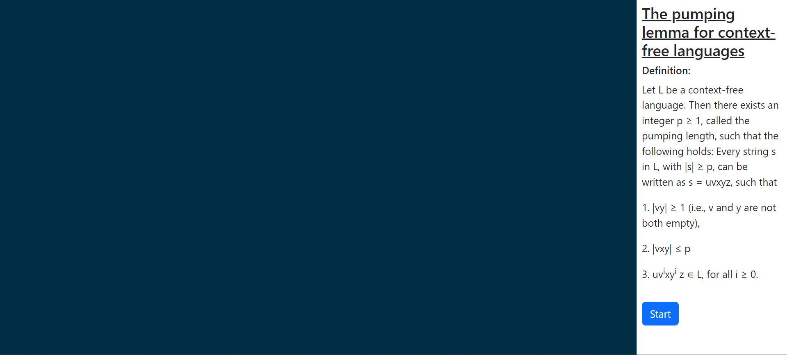
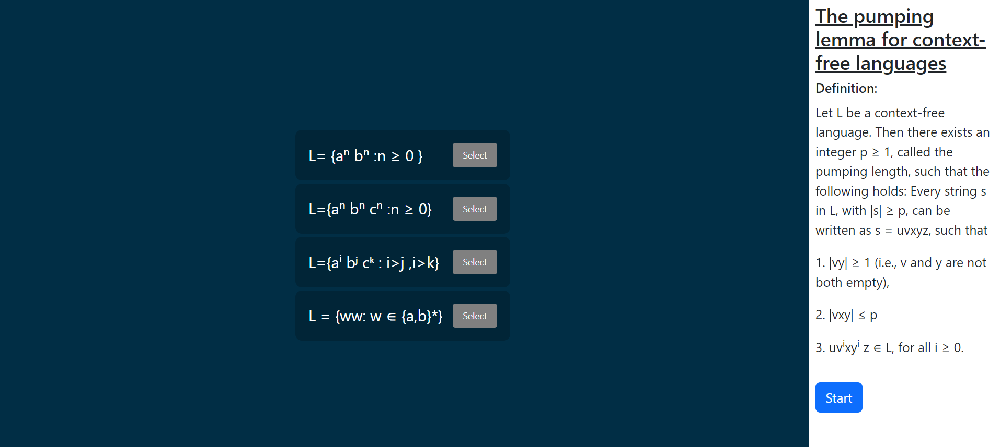
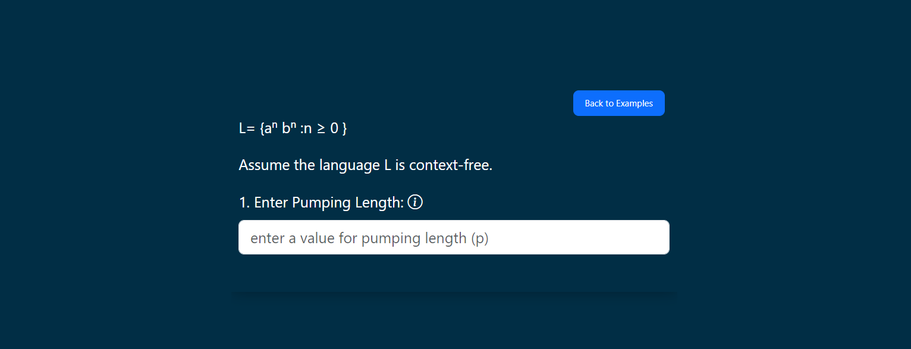
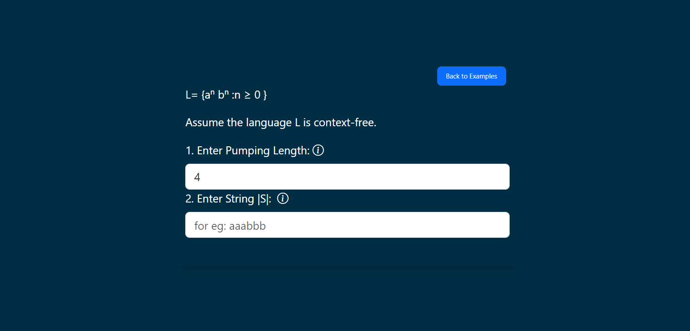
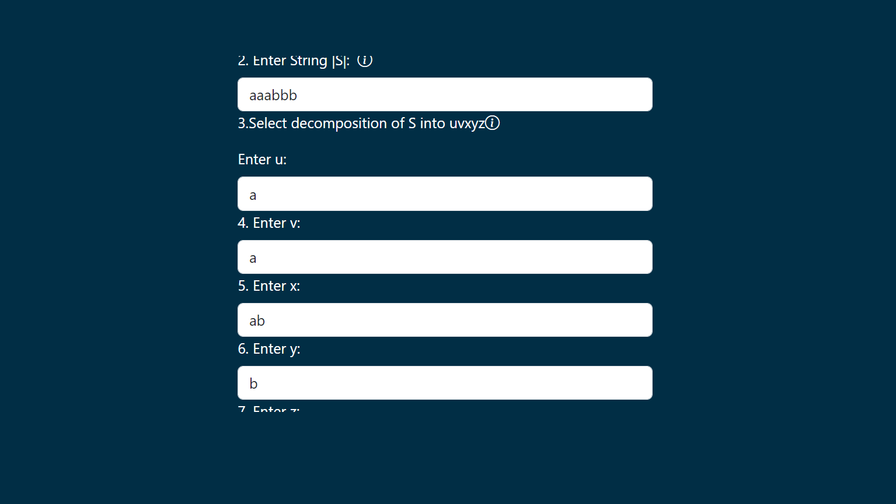
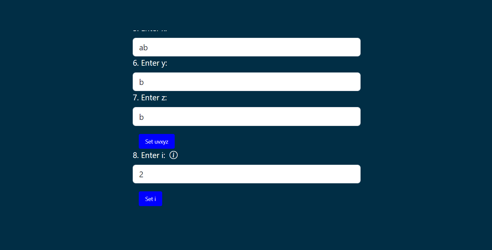
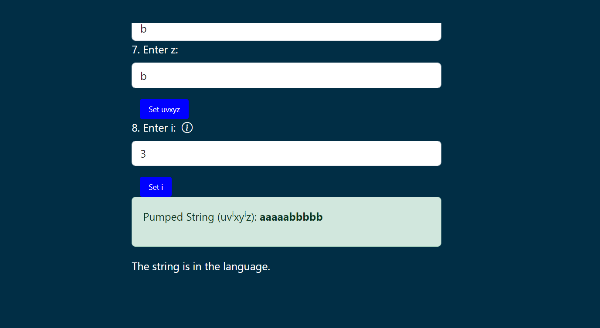
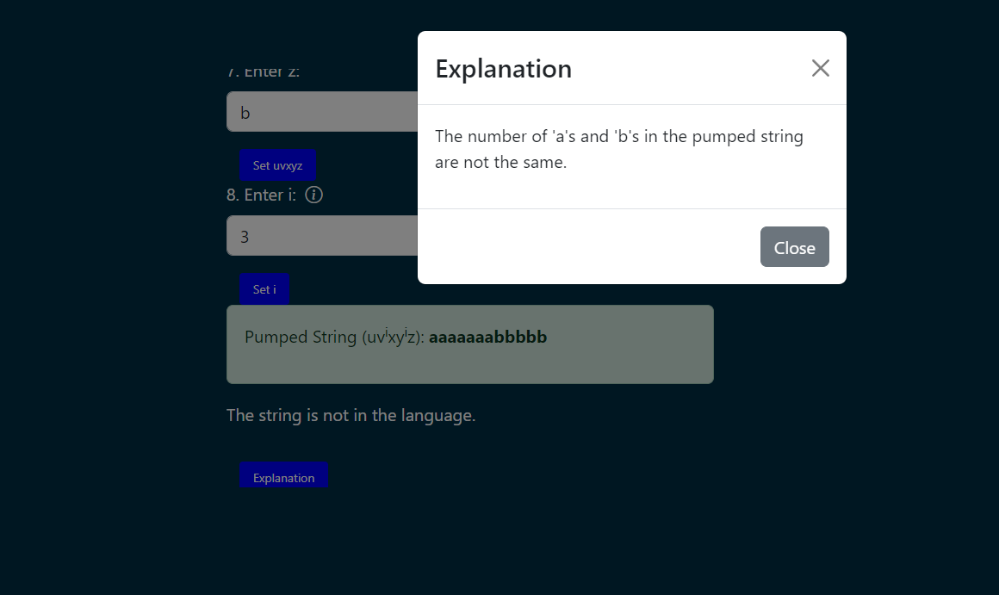

<u><h3>Procedure</u></h3>

1. To Identify context free languages using pumping lemma , select any example given and follow the instructions provided .

Read the 
theorem and click on the start button to start the simulation 

select any example and follow the instructions provieded 

Enter the value for pumping length P 

Enter a string S that is in the language

decompose the  string S into uvxyz

Enter value of i

The lemma states that we can "pump" the substring v and y  by inserting copies of it "i" times, if all the conditions are satisfied then the string is in the language 

if any of the conditions are not satified then string is not in the language  you can always find the explanation by clicking on the explanation button 

