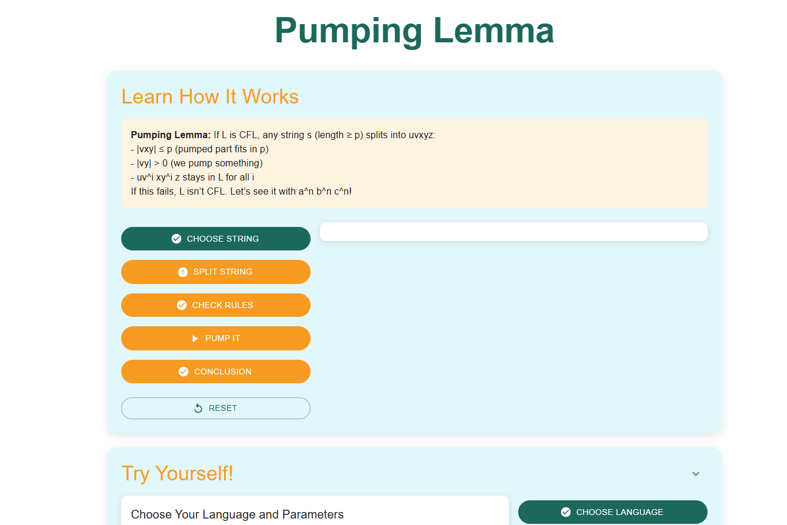
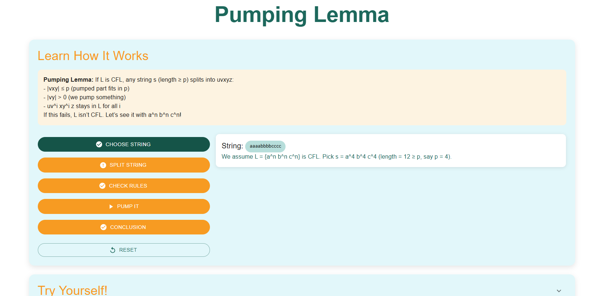
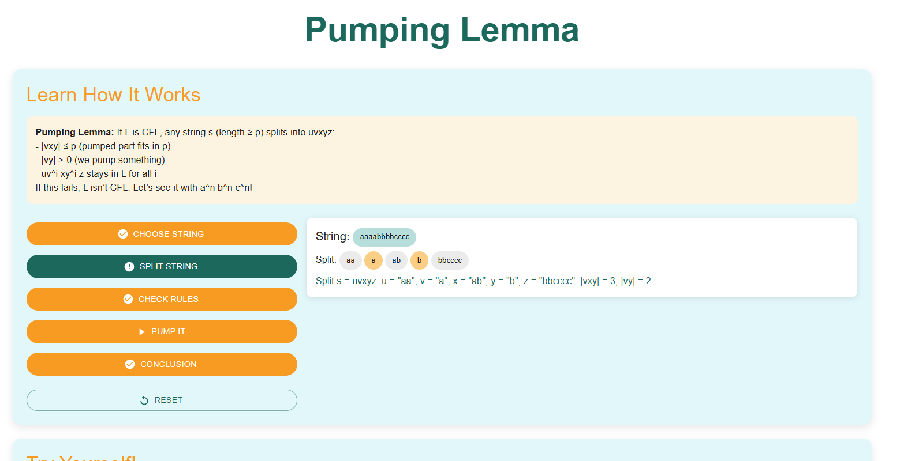
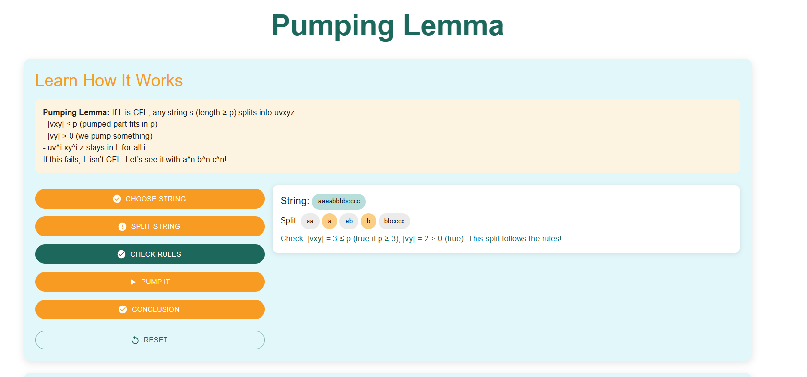
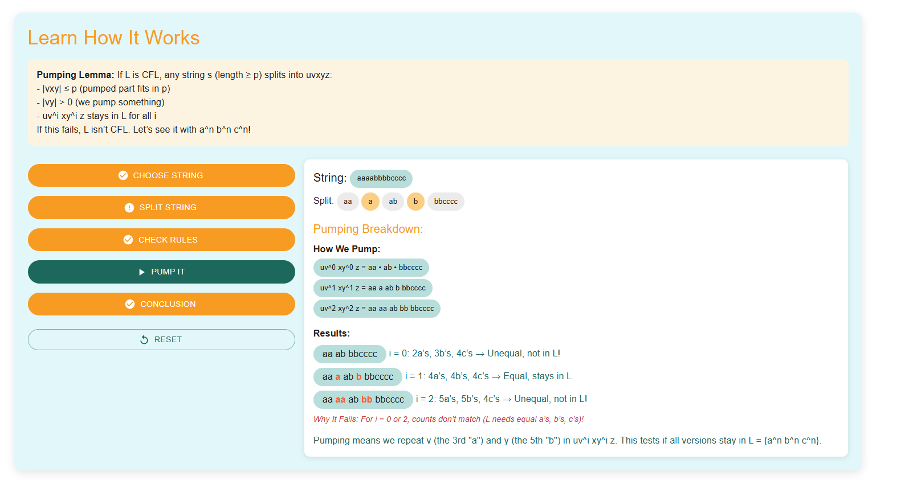
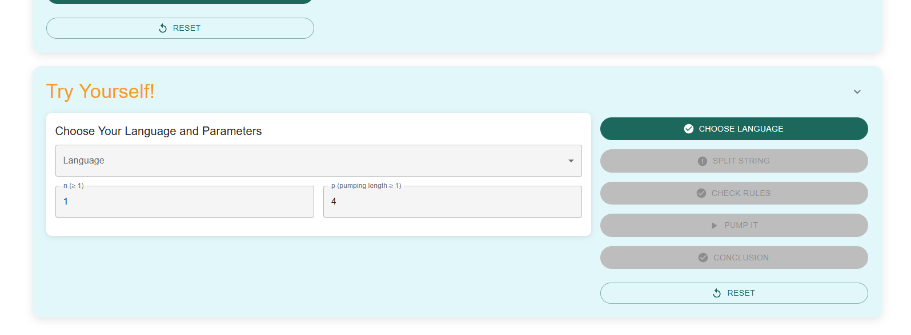

<h5>Step 1: Understand and Analyze the Theorem</h5>

Observe and carefully read the Pumping Lemma theorem to grasp its conditions and implications for context-free languages.

<h5>Step 2: Select a String</h5>

Click on the <strong>“Choose the String”</strong> button to start the process. Observe the string being created.

<h5> The Length (L) and Pumping Constant (p)</h5>

    The length of the selected string is represented as <strong>L</strong>. 
    In the Pumping Lemma, there is a special value called the <strong>pumping constant (p)</strong>, 
    which is a number given by the theorem. 
    If a language is context-free, any string with a length <strong>L ≥ p</strong> must be able to be split and "pumped" while still remaining in the language.

<h5>Step 3: Split the String</h5>

Divide the selected string into five parts: <strong>u, v, x, y, z</strong>, following the conditions of the Pumping Lemma. 
   The decomposition should satisfy the given constraints, ensuring that <em>v</em> and <em>y</em> can be pumped while maintaining the language's properties.

<h5>Step 4: Verify the Pumping Lemma Conditions</h5>

Check if the decomposition <strong>(u, v, x, y, z)</strong> satisfies the Pumping Lemma rules:

<ul>
    <li>The length of the string must be at least <em>p</em> (pumping length).</li>
    <li>The string is divided into five parts: <em>u, v, x, y, z</em>.</li>
    <li><em>v</em> and <em>y</em> must not be empty (<em>|vy| > 0</em>).</li>
    <li><em>vxy</em> must be within the first <em>p</em> characters.</li>
    <li>The string must remain in the language for all values of <em>i</em> (pumping).</li>
</ul>

<h5>Step 5: Pump the String</h5>

Enter a value for <em>i</em> to pump the string. The substrings <strong>v</strong> and <strong>y</strong> will be repeated <em>i</em> times while keeping <strong>u</strong>, <strong>x</strong>, and <strong>z</strong> unchanged.

Observe how the modified string changes with different values of <em>i</em> and check if it still belongs to the given language.

<h5>Step 6: Click Conclusion for Final Results</h5>

Click on the <strong>“Conclusion”</strong> button to determine whether the given language is context-free.

Based on the results of the pumping process, check if the string still belongs to the language. If it fails the conditions, the language is not context-free.

<h5>Explore and Experiment</h5>

Use the <strong>Try Yourself</strong> section to test different strings and analyze their behavior using the Pumping Lemma.

Follow the steps, modify the pumping factor <em>i</em>, and observe how the string changes. Determine whether the language satisfies the context-free conditions.

